# RVTools Analyzer

A native macOS app (SwiftUI + Swift Charts) that ingests an **RVTools** export and correlates every tab into one object model of the vSphere estate. It then rolls the data up into dashboards for counts, capacity, utilization, configuration, lifecycle and health.

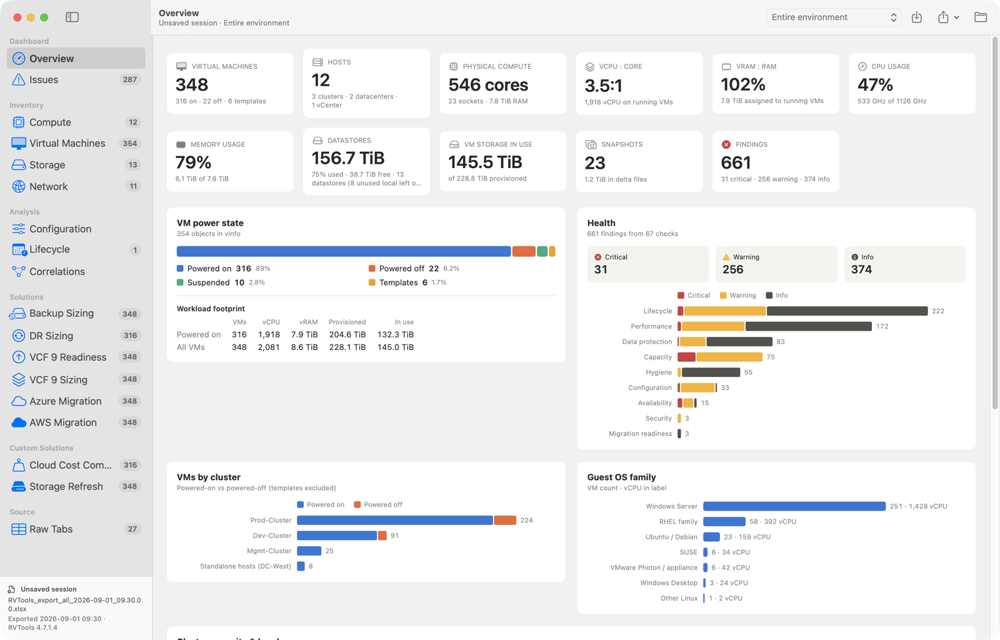

Everything runs locally and your RVTools data never leaves the Mac. The only network access is the optional download of public cloud price lists (see Solutions). There are no third-party dependencies: the `.xlsx` reader (ZIP + XML) is built in. You can add your own solutions without rebuilding the app (see [Custom solutions](#custom-solutions)).

## Build & run

Requirements: macOS 14 or later and the Swift toolchain (Xcode or the Command Line Tools: `xcode-select --install`).

```bash
scripts/build-app.sh            # → build/RVTools Analyzer.app
open "build/RVTools Analyzer.app"
```

Drag the app to `/Applications` if you like. It is ad-hoc signed, so the first launch may need right-click › **Open**.

If the Command Line Tools are the active developer directory (`xcode-select -p`) and Xcode is installed, the build scripts use Xcode's toolchain: the Command Line Tools can lack the SwiftUI macro plugins, for example right after a macOS upgrade.

### Everyday use alongside development

- **`scripts/install-app.sh`** builds the release app, runs `scripts/check-solutions.sh`, and copies the app to `/Applications/RVTools Analyzer.app`. The check runs every installed custom solution against the sample exports; if one fails, the install stops (`--force` installs anyway).
- **`scripts/build-app.sh dev`** (or `debug`) builds **RVTools Analyzer Dev.app** for development. It has its own bundle id, so settings, recent projects and saved assumptions are separate. It also has its own `~/Library/Application Support/RVTools Analyzer Dev/` folder, so it never loads the solutions and price lists of the copy you use for real. The two copies share only the public cloud price cache.
- **Telling the copies apart.** The Dev build has an orange **DEV** band on its icon and a "Dev build" label in the sidebar and on the start screen. **About** in either copy shows the commit it was built from (`git describe`, with `-dirty` for uncommitted changes) and when it was built.
- **Private solutions can live in a synced folder** such as a company OneDrive. Make `~/Library/Application Support/RVTools Analyzer/Solutions` and `…/Price Lists` symlinks to that folder. Installs from the app then land there, and edits there reload automatically.

## Opening data

- **An RVTools `.xlsx` export** (`RVTools_export_all_*.xlsx`)
- **A folder of CSVs** from RVTools' *Export all to csv* (`RVTools_tabvInfo.csv`, …)
- **Several exports at once.** Drop multiple files or folders to merge vCenters into one view. Rows are keyed by `VI SDK Server`, so objects from different vCenters don't collide.

To open an export you can:
- drop it on the window,
- use **File › Open** (⌘O),
- use the Finder's **Open With**, or
- run `RVToolsAnalyzer <path>` from a shell.

**Try Sample Data** on the welcome screen loads a synthetic environment.

### Projects

**Save Project** (⌘S) turns the current session into a `Name.rvaproj` project. Finder shows it as one file, but it's a folder that contains:
- a copy of the export(s)
- your settings: thresholds, acknowledged findings, scope, each solution's VM selection and assumptions, and the open page
- project notes
- the cloud price lists behind any estimates, so they can be reproduced later, and copies of the custom price lists your custom solutions use

After the first save, changes save automatically. If you've customized an unsaved session, the app offers to save it before you close the window, quit or open something else. Open projects like exports (⌘O, drag and drop, or double-click in Finder). Recent projects are on the start screen and under File › Open Recent Project.

Projects are ordinary files, so they can sit next to the customer's exports in OneDrive or SharePoint, or in iCloud Drive to sync across your Macs. The app doesn't use iCloud directly: that would need an Apple Developer membership and a provisioned, signed build, and it would move customer data out of company storage. `rvtools-cli Customer.rvaproj --solution azure` runs a solution with the project's saved selection and assumptions, and `--save-project <path>` creates a project from the CLI.

### Trend mode (Compare Snapshots)

Opening several exports normally *merges* them into one view of several vCenters (the single-snapshot mode above, unchanged). **Compare Snapshots…** (⌥⌘O, or on the start screen) instead treats exports of the **same environment taken at different times** as a time series:

- Each export is one point in time, ordered by its export timestamp. Exports of *different* vCenters taken within 12 hours are combined into one snapshot, so a multi-vCenter estate can be trended too. A folder containing several exports can be chosen directly.
- VMs are matched across snapshots by vCenter + VM UUID (then VM ID, then name), so renames are recognised as renames rather than remove + add.

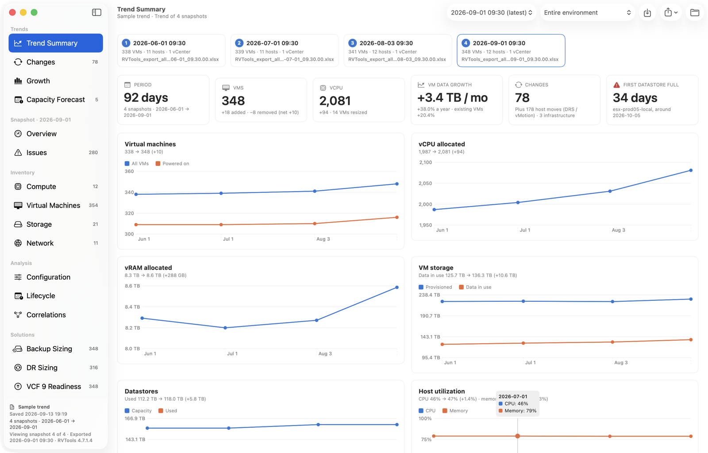

The **Trends** section of the sidebar adds:

| Page | What it shows |
|---|---|
| **Trend Summary** | The snapshots (click one to open its dashboards), headline changes, charts over time (VMs, vCPU, vRAM, VM storage, datastores, host utilization) and a table of changes per interval. |
| **Changes** | Every VM add, remove, rename, vCPU/memory resize, disk change, cluster/host/datastore move, power change, upgrade (HW version, Tools, guest OS), network change and snapshot change — plus infrastructure changes (hosts added/removed/updated, datastores added/expanded, cluster HA/DRS changes, vCenter updates). DRS/vMotion host moves are hidden unless you ask. Selecting a VM shows its full history. |
| **Growth** | Observed growth (net and for VMs present throughout) of data, provisioned storage, datastore use, VMs, vCPU and vRAM, per month and annualised, with per-VM growth. **Apply** puts the observed annual growth into the Backup and DR sizing assumptions, and into custom solutions whose growth assumption offers it. |
| **Capacity Forecast** | Days until each datastore is full at its observed rate, aggregate runway, and cluster changes. |

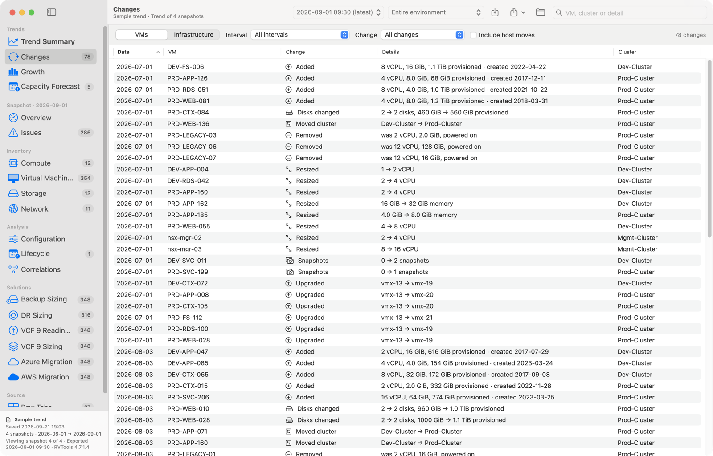

Below the Trends section, the normal dashboards and solutions work on one snapshot at a time — the latest by default; switch with the **Snapshot** picker in the toolbar. The VM inspector gains a history across snapshots. **Export › Trend Report to Folder…** writes the metrics, changes, growth and datastore forecast as CSV, and **Save Project** keeps every snapshot (`sources/snapshot-N/`) in the project.

What RVTools can't tell you: exports are point-in-time totals, so the *daily change rate* (blocks rewritten per day) can't be measured — net growth is shown as a lower bound. Anything that happened and reverted between two exports is invisible, and rates need weeks or months of history to mean much.

Ages are measured from the export timestamp in `vMetaData` or the file name, not from today. That applies to snapshot age, host uptime, certificate expiry and end-of-support status, so an old export shows what was true when it was taken.

## Dashboards

| Page | What it rolls up |
|---|---|
| **Overview** | Headline figures: VMs, hosts, cores, vCPU:core, vRAM:RAM, CPU/memory use, storage, snapshots, findings. Also VM power state, workload footprint, VMs per cluster, OS family, a cluster capacity + N+1 table, the most-used datastores and the top issues. |
| **Issues** | 70+ rule checks grouped by check, with severity, category and object-type filters, search, a recommendation per check, and a jump to each affected object. **Acknowledge** findings you've reviewed and accepted, one at a time, a whole check's current findings, or the whole check including future findings, with an optional note. Acknowledged findings are left out of counts, badges, the Overview, object inspectors and CSV exports. The **Acknowledged** view lists them with their notes, and **Restore** brings them back. Projects save acknowledgements, and they match by check and object, so they carry over to a newer export of the same environment. |
| **Compute** | Cluster cards (HA/DRS/admission control, capacity, consolidation ratios, CPU/memory used, memory if the largest host fails, ESXi/CPU mix) and host utilization. The hosts table has an inspector covering the host's VMs, datastores, pNICs, VMkernel adapters, HBAs, LUN paths and findings. |
| **Virtual Machines** | A searchable, sortable inventory (search by name, IP, host, OS, network, datastore or notes). The inspector shows everything joined to the VM: placement, compute, disks, guest partitions, NICs with VLANs, snapshots, Tools/HW/firmware, findings and vHealth messages. |
| **Storage** | Capacity, used, provisioned (overcommit), thin vs thick, reclaim opportunities (powered-off VMs, snapshots, templates, guest free space, empty datastores, zombie files) and snapshot age. The datastores table has an inspector listing each datastore's VMs and hosts. |

**Local datastores with no VM files.** Host-local datastores that hold no VMs, templates or VM disks, usually ESXi boot or scratch devices, are left out by default. They don't count in capacity totals, findings (such as low free space or "datastore with no VMs"), charts, trends, exports or solutions. A datastore counts as local when exactly one host mounts it and it isn't vSAN or NFS. Local datastores that VMs use always count. When any are left out, the Storage page says how many, with a button to include them; the same switch is in **Settings › Findings**, and projects save it.
| **Network** | Port groups with VLANs, observed subnets, the switch they're on, host and VM counts, and security policy. RVTools doesn't record VM netmasks, so observed subnets are inferred from the guest IPv4 addresses on each port group's VM NICs: grouped into /24 blocks, merged where neighbouring blocks are all in use, with a warning when the same range shows up on another port group. VMkernel adapters show their exact CIDR from the reported mask. Also distributed and standard switches, VMkernel adapters, physical NICs, and adapter types. |
| **Configuration** | Distributions: guest OS, vCPU and memory sizes, firmware/Secure Boot, disk controllers, NIC types, resource controls, CPU models, hardware, link speeds. |
| **Lifecycle** | **License renewals** at the top: licenses that have expired or expire within 90 days of today (adjustable in Settings; unlike support dates, renewals are measured from today even for an older export), plus evaluation licenses, with quantities and days left; the sidebar badge counts them. Also guest OS end-of-support status, ESXi and vCenter support dates, virtual hardware versions, VMware Tools status, VM creation by year, host uptime, and every license with its status. |
| **Correlations** | The entity graph, what each cross-tab relationship reveals, join coverage per tab, and consistency checks (RVTools' own counts vs the counts derived from other tabs). |
| **Raw Tabs** | Every tab exactly as loaded, including custom-attribute columns, in a fast sortable and filterable grid. |

| | |
|---|---|
| 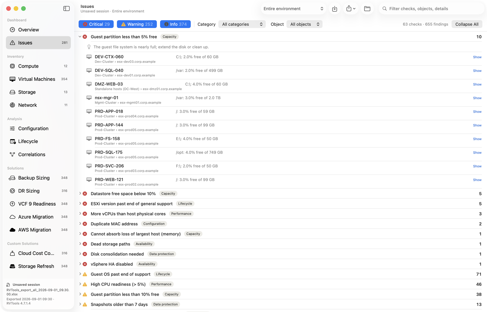 | 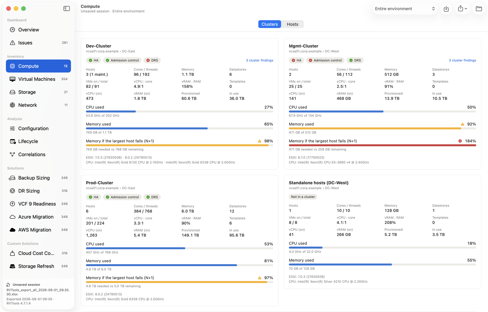 |
| **Issues** — checks grouped by rule, with the affected objects | **Compute** — cluster capacity, consolidation and N+1 headroom |
| 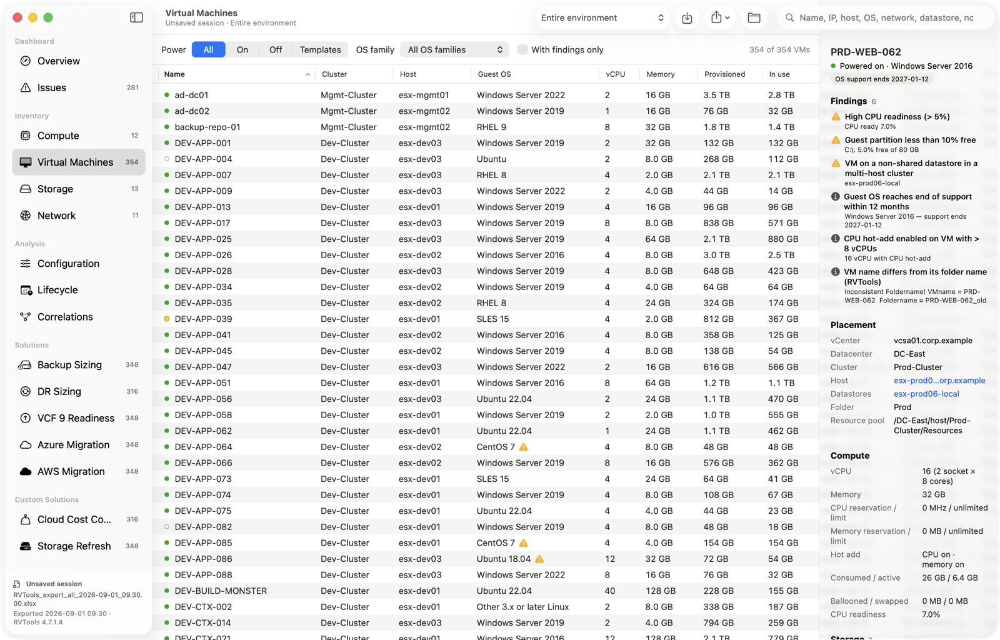 | 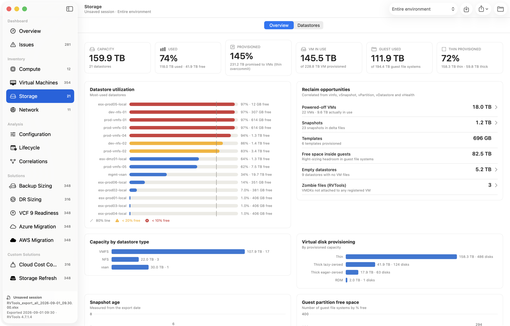 |
| **Virtual Machines** — inventory with the VM inspector | **Storage** — capacity, overcommit and reclaim opportunities |

### Relationship maps

Every VM, host, cluster, datastore and port group has a **Relationship Map** button (in its inspector, or on the cluster card). It opens a map in its own window with the object in the middle and everything RVTools links it to around it:

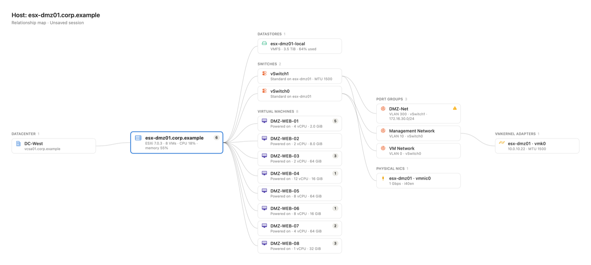

| Map | Shows |
|---|---|
| **VM** | Datacenter → cluster → host, folder / resource pool / vApp, then datastores (with the disks on each) → storage devices, and networks (NICs and IPs) → switches → the host's uplinks, and VLANs. |
| **Host** | Datacenter → cluster, its VMs, datastores → storage devices, switches → port groups and physical NICs → VMkernel adapters. |
| **Cluster** | Its hosts, datastores, port groups (→ switches and VLANs) and VMs. |
| **Datastore** | Clusters → hosts that mount it, its storage devices (paths per host) and the VMs with files on it. |
| **Storage paths** | The same datastore without its VMs: hosts → their storage adapters (or, for NFS, the VMkernel adapters that reach the server and the uplinks behind them) → the datastore → the devices or NFS export behind it. Dead paths, single paths and single adapters are marked. |
| **Port group** | Hosts and their uplinks → switch, then VLANs, VMkernel adapters and the VMs connected to it (with IPs). |

Hover over an object to highlight what it's connected to (and details such as a VM's disks on a datastore). Click an object to centre the map on it, and use **Back** to return. Large groups show the first few objects and a **+N more** button. Warning icons mark things like maintenance mode, links down, datastores 90% full or more, dead storage paths and permissive port group security, and a count shows findings.

**Export** on the map window writes the map's relationships as CSV (one row per connection) or the map as a PNG image. For planning across many objects, **Export › VM ↔ Networks, VM ↔ Datastores, Host ↔ Networks and Host ↔ Datastores** write one row per relationship, so one spreadsheet filter answers both directions: filter on networks to list the VMs using them, or on VMs to list their networks.

The maps show infrastructure relationships only. RVTools doesn't see traffic between VMs, so they aren't application dependency maps.

## Solutions

The **Solutions** section of the sidebar turns a chosen set of VMs and editable assumptions into a report. Each solution has three steps:

1. **Select VMs** — filter by name, cluster, power state or OS family, then add or remove the shown or highlighted VMs, or tick them one by one. Each solution keeps its own selection. A solution can also ask for several selections (for example *DR scope* and *Pilot light*): a picker above the list chooses which one the checkboxes edit, and VMs show a badge for the other selections they're in.
2. **Assumptions** — change rates, retention, host specs and so on. They are saved and reused for every export you open.
3. **Results** — headline figures, sizing tables, a checklist with the affected objects, and a per-VM breakdown. **Export Report…** writes a Markdown report plus CSV tables and the list of selected VMs.

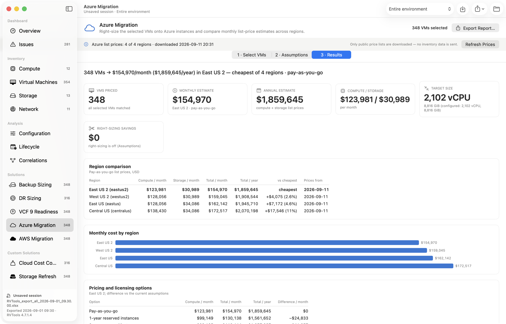

| Solution | What it produces |
|---|---|
| **Backup Sizing** | Protected data (guest used, in-use or provisioned), primary repository capacity for daily points and GFS fulls with growth and headroom, offsite copy, throughput for the backup window, licensing counts (VMs, hosts, sockets), and coverage gaps (independent, RDM or shared disks, no Tools, consolidation). |
| **DR Sizing** | DR hosts, sized by whichever of CPU, memory or storage needs the most, plus spares; replica storage with point-in-time history; average and peak replication bandwidth against the link and RPO; initial seed time; a DR network map of port groups, VLANs and subnets; and replication blockers. |
| **Azure Migration** / **AWS Migration** | **Lift-and-shift (rehost) estimates only:** each VM moves as-is to a cloud VM; modernization (PaaS, managed databases, containers, serverless, re-architecture) isn't in scope. Right-sizes each VM, either as configured or from the CPU and consumed memory in the export plus a buffer. It then picks the cheapest instance that fits in your chosen families, prices each disk as a managed disk tier or EBS volume, and compares monthly and annual cost across the selected regions. Also shows pricing-model options (Azure pay-as-you-go vs 1- or 3-year reservations; AWS on-demand vs your commitment discount), Windows licensing (Hybrid Benefit / BYOL), right-sizing savings, instance and storage mix, and a per-VM estimate. |
| **VCF 9 Readiness** | Checks on the clusters, hosts and vCenters behind the selected VMs: upgrade path, CPU generation, NTP, DNS, certificates, uplinks (count and 10 Gbps), cluster size for a simple or high-availability deployment, DRS fully automated, HA, host-evacuation headroom, a datastore shared by every host, vSAN stretched-cluster sites and vSphere Supervisor. It also flags the unsupported configurations for converging to VCF 9.1 that RVTools can show: no distributed switch, vDS below 8.0, Cisco virtual switches, VMkernel adapters using DHCP, and a vCenter VM running under another vCenter. Plus vDS vs standard switches, datastore types (vVols and iSCSI flagged), VM live-migration blockers and VCF core licensing. |

**Cloud prices.** The Azure and AWS solutions use public list prices (USD), downloaded only when you click **Download Prices**. They're cached for 7 days in `~/Library/Caches/RVToolsAnalyzer/pricing`. Only the price lists are fetched; no inventory data is sent. Azure prices come from the [Azure Retail Prices API](https://prices.azure.com/api/retail/prices) (pay-as-you-go, reservations, managed disks). AWS prices come from the public price files behind the aws.amazon.com pricing pages (on-demand EC2 Linux/Windows and EBS). AWS doesn't publish Savings Plan or Reserved Instance prices in a lightweight file, so enter your expected commitment discount. `rvtools-cli --prices azure|aws` downloads every region and reports what it found. Not included: egress, backup, monitoring, OS subscriptions (RHEL/SLES), SQL and other application licences, support and negotiated discounts.

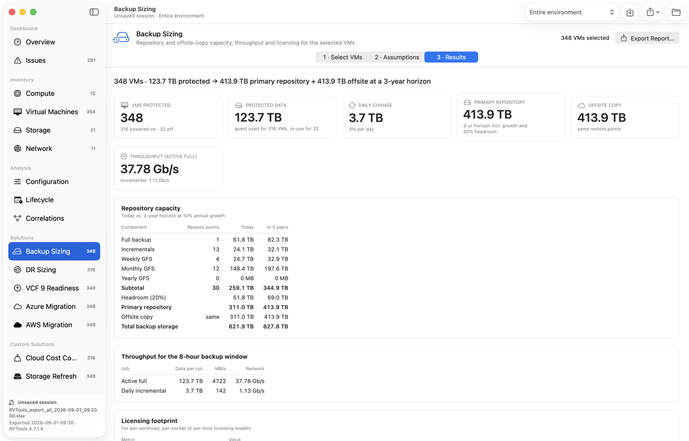

The rules and defaults are built in; confirm them against current vendor documentation. VCF 9 upgrade paths and CPU support are the ones most likely to need checking. `rvtools-cli <export> --solution backup|dr|vcf9|azure|aws` prints a report from the terminal.

### Custom solutions

Anyone can add a solution to a packaged copy of the app, without Xcode or a rebuild: a folder (`Name.rvasolution`) with a `manifest.json` that declares its assumptions and a JavaScript file whose `run(vms, inventory, params, context)` returns the results. Custom solutions appear under **Custom Solutions** in the sidebar and get the same VM selection, assumptions form, results, export and project saving as the built-in ones. The built-in solutions are fixed as of v1.0, and their ids are reserved.

- **Safe to share.** Scripts run in a sandboxed JavaScriptCore context: no network, files or processes, and a time limit. A shared solution can't send customer data anywhere.
- **Prices without internet access.** A solution can read the Azure and AWS list prices the app has already downloaded, and use the same right-sizing and best-fit code as the built-in migration solutions (`rva.cloud`). It can also read **price lists** (`.rvaprices`): negotiated discounts on the list prices, or complete private-cloud or partner rate cards.
- **Installing.** Drop a pack or price list on the app, or use the **Solutions** menu or **Settings › Solutions / Price Lists**. Packs live in `~/Library/Application Support/RVTools Analyzer/` and reload automatically when edited.
- **Examples.** **Solutions › Install Examples** installs *Storage Refresh* and *Cloud Cost Compare* (Azure vs AWS vs a negotiated-rate list and a private cloud rate card) from `examples/`.

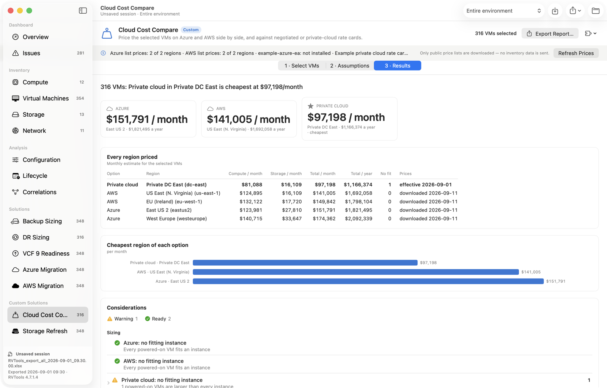

The authoring guide, with the manifest, inventory, results, helpers and price list format, is [docs/SOLUTIONS.md](docs/SOLUTIONS.md) (also under **Solutions › Authoring Guide**). To test a pack: `rvtools-cli --validate-solution my.rvasolution export.xlsx`.

The **Scope** picker in the toolbar limits every page to one vCenter, datacenter or cluster. Datastores and networks follow the hosts and VMs in scope.

**Export** writes CSVs of the findings, the correlated VM inventory, hosts, clusters and datastores. **Settings** (⌘,) holds the thresholds and whether local datastores with no VM files are left out; findings recalculate immediately when you change them. **Settings › Units** chooses how storage is shown, in binary units (MiB, GiB, TiB, the default, as vSphere calculates capacity) or decimal units (MB, GB, TB), and network rates in bits (Mbps, Gbps, the default) or bytes (MB/s, GB/s). The choice applies to the dashboards, findings, solution results, relationship maps and CSV exports. Memory is always shown in binary units, because RAM is sized in powers of two.

## How tabs are correlated

```
vCenter (vSource, vLicense) → Datacenter → Cluster (vCluster) → Host (vHost) → VM (vInfo)
VM   ⨝ vCPU · vMemory · vTools · vDisk · vPartition · vNetwork · vSnapshot · vCD · vUSB · vHealth
VM   ⨝ Datastore      via the [datastore] prefix of VMDK / .vmx paths
VM   ⨝ Port group     via vNetwork.Network ⨝ vPort / dvPort (→ VLAN, switch, security policy)
Host ⨝ vNIC · vHBA · vSC_VMK · vSwitch · vMultiPath (→ Datastore)
Host ⨝ Datastore      via vDatastore.Hosts
```

VM rows are matched by `VM ID`, then `VM UUID`, then name (all scoped to the vCenter). Columns are looked up by name, never by position, and older headers such as `… MB` vs `… MiB` are handled. That makes RVTools 3.x and 4.x exports, and environment-specific custom-attribute columns, work the same way.

## Command line

```bash
swift build -c release --product rvtools-cli
.build/release/rvtools-cli <export.xlsx | csv-folder> [--export <dir>]
```

This prints the inventory, cluster headroom, join coverage, consistency checks, findings and distributions. With `--export` it also writes the CSVs, including the four relationship exports.

`--units binary|decimal` and `--rate bits|bytes` choose the display units, as in Settings › Units.

`--map vm:NAME` (or `host:`, `cluster:`, `datastore:`, `portgroup:`) prints an object's relationship map as text; with `--export <dir>` it also writes the map's CSV.

`rvtools-cli <export or project> --solution <id>` prints a solution's report. `--set name=value` overrides an assumption, and `--select <selection>=<all|vms|poweredOn|none|VM names>` overrides a VM selection; both are also applied by `--save-project <path>`.

Custom solutions: `--list-solutions` shows installed packs, price lists and cached prices; `--validate-solution <pack> [export]` checks a pack and runs it with its console output; `--solutions <dir>` and `--price-list <file>` load packs and price lists without installing them. See [docs/SOLUTIONS.md](docs/SOLUTIONS.md#testing-from-the-command-line).

`rvtools-cli --trend <exports or folder…> [--save-project <path>]` prints the trend analysis (metrics, growth, changes per interval, top-growing VMs, datastore forecast, infrastructure and VM changes) and can save it as a trend project; opening a trend project with `rvtools-cli <project>` prints the same.

## Sample data

`python3 scripts/generate_sample.py` (requires `openpyxl`) regenerates a fictional environment in `samples/`, as both an `.xlsx` and a CSV folder. It contains deliberate issues for every dashboard to show. The build script bundles the `.xlsx` into the app as the **Try Sample Data** file.

`python3 scripts/generate_series.py` derives four monthly exports of the same environment from it in `samples/series/`, with known adds, removals, resizes, moves, upgrades, a rename, data growth, a new host, an ESXi update and a datastore expansion. It's bundled as **Try Sample Trend**, and `rvtools-cli --trend <exports> --save-project <path>` saves it as a trend project to open in the app.

## Screenshots for review

The app can render every page to PNG itself, which needs no Screen Recording permission:

```bash
open -W -n --env RVTA_SNAPSHOT_DIR=/tmp/shots --env RVTA_SNAPSHOT_QUIT=1 \
  -a "build/RVTools Analyzer.app" samples/RVTools_export_all_*.xlsx
```

Add `--env RVTA_APPEARANCE=dark` to capture in dark mode.

**`scripts/docs-screenshots.sh`** regenerates the images in `docs/images` that this README and the authoring guide use. It captures the sample data and the example solutions with the Dev build, with its markings hidden (`RVTA_HIDE_DEV_BADGE=1`) and a throwaway support folder (`RVTA_SUPPORT_FOLDER`), so installed solutions, price lists and settings never appear in them.

## Project layout

```
Sources/RVToolsCore/          parsing (Zip, XLSX, CSV, Dataset), Correlate, Rules, Analysis, Lifecycle, Export
Sources/RVToolsCore/Solutions built-in solutions, SolutionKit (parameters/results), cloud pricing and sizing
Sources/RVToolsCore/Custom    custom solutions: pack loading, JavaScript runtime and helpers, inventory API, price lists
Sources/RVToolsAnalyzer/      SwiftUI app (one file per page + shared components/theme)
Sources/rvtools-cli/          headless runner
docs/SOLUTIONS.md             custom solution authoring guide
docs/images/                  screenshots (scripts/docs-screenshots.sh)
examples/                     example solution packs and price lists (bundled into the app)
scripts/                      build-app.sh, install-app.sh, check-solutions.sh, docs-screenshots.sh, make_icon.swift, generate_sample.py, generate_series.py
```

End-of-support dates for Windows, RHEL/CentOS, Ubuntu, Debian, SLES, ESXi and vCenter are built into `Sources/RVToolsCore/Lifecycle.swift`. Thresholds for the rules live in `Thresholds` (`Rules.swift`) and are editable in Settings.
