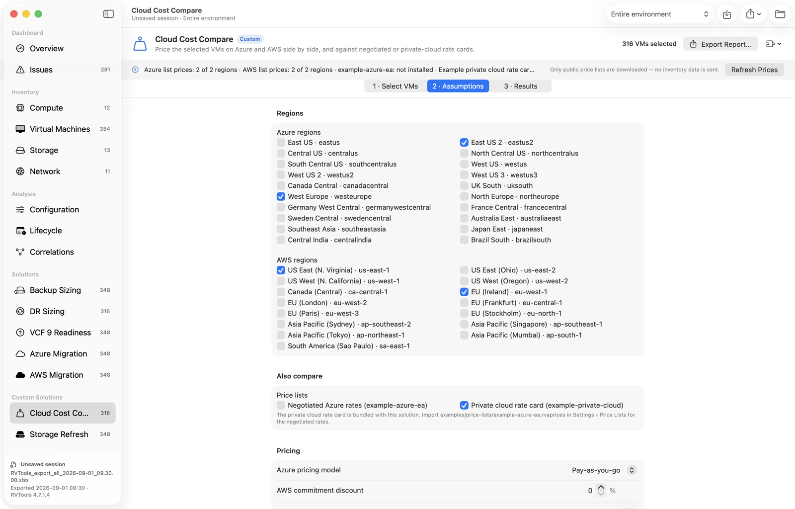

# Writing custom solutions

RVTools Analyzer ships with five built-in solutions: Backup Sizing, DR Sizing, VCF 9 Readiness, Azure Migration and AWS Migration. You can add your own without changing or rebuilding the app. A custom solution is a folder containing a `manifest.json` and a JavaScript file. Anyone with the app can install it, and it shows up in the sidebar under **Custom Solutions**.

A custom solution gets the same treatment as a built-in one:
- the same three steps: **Select VMs**, **Assumptions** and **Results**
- the same **Export Report…** (Markdown plus CSV)
- saving with the project
- click-through from results to VMs, hosts and datastores

It can also read the Azure and AWS prices the app already has, and your own price lists.


- [How it works](#how-it-works)
- [Quick start](#quick-start)
- [The pack](#the-pack)
- [manifest.json](#manifestjson)
- [Parameters](#parameters)
- [The script](#the-script)
- [Results](#results)
- [Inventory reference](#inventory-reference)
- [The `rva` helpers](#the-rva-helpers)
- [Prices](#prices)
- [Price lists (.rvaprices)](#price-lists-rvaprices)
- [Installing and sharing](#installing-and-sharing)
- [Testing from the command line](#testing-from-the-command-line)
- [Limits and compatibility](#limits-and-compatibility)

## How it works

When the Results step opens, the app runs your script's `run(vms, inventory, params, context)` function in the background and shows what it returns. The script runs again whenever the selection, assumptions, scope, snapshot or available prices change.

Scripts run in a fresh, sandboxed JavaScriptCore context on the Mac:

- **No network, files or processes.** A script can't make requests, read or write files, or start processes. Customer data never leaves the Mac, and the worst a shared solution can do is compute the wrong numbers.
- **Read-only access.** It sees the inventory in scope, the parameter values, the `rva` helpers, and only the prices its manifest declares.
- **A time limit.** A run that takes longer than `timeoutSeconds` (20 by default) is stopped and reported as an error.
- **Errors stay on the page.** Syntax errors, exceptions and malformed results appear on the Results step with the file and line, instead of crashing the app.

## Quick start

1. In the app, choose **Solutions › Install Examples**. This installs *Storage Refresh* (no prices) and *Cloud Cost Compare* (Azure, AWS and price lists) from `examples/solutions/`.
2. Choose **Solutions › Open Solutions Folder**, duplicate `storage-refresh.rvasolution`, and give the copy a new `id` and `title` in its `manifest.json`.
3. Open an export and pick your solution under **Custom Solutions**. Edits to `manifest.json` or `solution.js` reload automatically when you save.

Or test it against an export from the terminal:

```bash
rvtools-cli --validate-solution ~/Desktop/my-solution.rvasolution samples/RVTools_export_all_2026-09-01_09.30.00.xlsx
```

## The pack

```
my-solution.rvasolution/     any folder name works; .rvasolution is the convention
  manifest.json              required
  solution.js                required (or the file named by "script")
  prices/*.rvaprices         optional price lists bundled with the solution
  README.md                  optional, for people you share it with
```

## manifest.json

```json
{
  "apiVersion": 1,
  "id": "storage-refresh",
  "title": "Storage Refresh",
  "symbol": "internaldrive.fill",
  "summary": "Size replacement primary storage for the selected VMs.",
  "version": "1.0.0",
  "author": "Your name",
  "defaultSelection": "vms",
  "pricing": { "providers": ["azure"] },
  "parameters": [ … ]
}
```

| Field | Required | Meaning |
|---|---|---|
| `apiVersion` | yes | Always `1` for now. See [Limits and compatibility](#limits-and-compatibility). |
| `id` | yes | Unique id: lowercase letters, digits, `.`, `-` or `_`, up to 64 characters. It's the key for the solution's saved selection and assumptions in projects, so don't change it after sharing. The built-in ids (`backup`, `dr`, `vcf9`, `azure`, `aws`) are reserved. |
| `title` | yes | Name in the sidebar and reports. |
| `symbol` | | An [SF Symbols](https://developer.apple.com/sf-symbols/) name. Default: `puzzlepiece.extension`. |
| `summary` | | One line under the title. |
| `version`, `author` | | Shown in Settings › Solutions. |
| `script` | | Script file name. Default: `solution.js`. |
| `defaultSelection` | | Which VMs are selected when an export opens: `vms` (default: every VM except templates, SRM placeholders and vCLS agent VMs), `poweredOn` (those, powered on), `all` (everything, templates included) or `none`. |
| `selections` | | Several named VM selections instead of one. See [Several VM selections](#several-vm-selections). |
| `timeoutSeconds` | | 1–300. Default: 20. |
| `debug` | | `true` shows everything the script logs with `console.log` under the results. Warnings and errors are always shown. |
| `pricing.providers` | | Price providers the script may read: `azure`, `aws` and/or price list ids. See [Prices](#prices). |
| `pricing.allowDownload` | | Default `true`. Set it to `false` to hide **Download Prices**, so the solution only uses prices already downloaded, for example through the built-in Azure and AWS solutions. |
| `parameters` | | The Assumptions step. See [Parameters](#parameters). |

## Parameters



Every parameter has an `id`, a `type` and a `label`, plus optional `group` (the section heading, default "Assumptions"), `help` and `default`. The user's values are saved and reused for every export, and **Restore Defaults** resets them.

A `number` parameter can also set `observed`, so that in trend mode the Assumptions step shows what the snapshots measured beside it, like the built-in Backup and DR solutions do:

- **`annualGrowth`:** the net annual growth of VM data in use, with a button that applies it (rounded to 0.5%). **Apply** on the trend's Growth page sets it too.
- **`dailyChangeFloor`:** the net daily growth of existing VMs, shown as a lower bound for a daily change rate. There's no apply button: RVTools can't measure rewritten blocks, so the real change rate is usually much higher.

The script gets the same rates in `context.trend` (see [The script](#the-script)).

| Type | Extra fields | `default` | In `params` |
|---|---|---|---|
| `number` | `min`, `max`, `step`, `unit`, `observed` | a number | a number |
| `choice` | `options` (list of labels) | an index or a label | the chosen **index**; the label is in `context.labels[id]` |
| `toggle` | | `true` / `false` | a boolean |
| `multi` | `options` | a list of indices or labels | a list of chosen **indices** (`context.labels[id]` has the labels) |
| `regions` | `provider` (must also be listed in `pricing.providers`) | a list of region codes | a list of chosen **region codes** (`context.labels[id]` has the names) |

```json
"parameters": [
  { "id": "growth", "type": "number", "group": "Growth", "label": "Annual data growth", "default": 15, "min": 0, "max": 200, "unit": "%", "observed": "annualGrowth" },
  { "id": "basis", "type": "choice", "group": "Source data", "label": "Size from",
    "options": ["Guest used space", "VM in-use", "Provisioned"], "default": 0 },
  { "id": "snapshots", "type": "toggle", "group": "Source data", "label": "Include snapshot space", "default": false },
  { "id": "include", "type": "multi", "group": "Scope", "label": "Include",
    "options": ["Powered-on VMs", "Powered-off VMs", "Templates"], "default": [0, 1] },
  { "id": "azureRegions", "type": "regions", "provider": "azure", "group": "Regions", "label": "Azure regions", "default": ["eastus2"] }
]
```

A `regions` parameter lists every region the provider can price, whether or not its prices have been downloaded yet. For a price list, that means the list's regions (or every Azure / AWS region for a list `basedOn` one of them). It also drives **Download Prices** on the solution page.

Choices and multi-selects are saved as indices, so **add new options at the end** of an `options` list. Inserting or reordering options changes what saved projects mean.

## Several VM selections

Most solutions work on one set of VMs. A solution that needs more than one, for example the VMs protected by DR and the VMs that run in the cloud all the time, lists them in `selections`:

```json
"selections": [
  { "id": "dr", "label": "DR scope", "default": "poweredOn", "help": "VMs replicated to the DR site." },
  { "id": "pilot", "label": "Pilot light", "default": "none", "help": "VMs that run in the DR site all the time." }
]
```

- **Select VMs step:** a picker switches which selection the checkboxes edit. VMs also show a badge for each other selection they're in, and the header shows a count per selection.
- **First selection:** it's the primary one. The script gets it as `vms`, it drives the sidebar badge, and its `default` replaces `defaultSelection`. Other selections default to `none`.
- **In the script:** `context.selections` has every selection by `id`, as lists of VM objects, e.g. `context.selections.pilot`.
- **Storage:** projects save each selection. The primary one is under the solution id, as before, and the others under `<solution id>#<selection id>`.
- **Export Report:** writes `…_selected-vms.csv` for the primary selection and `…_selected-<id>.csv` for each of the others.
- **Limits:** up to 4 selections. Ids follow the same rules as solution ids. Don't rename an id after sharing, because saved projects use it.

## The script

Define a global function named `run`:

```js
function run(vms, inventory, params, context) {
  const total = rva.sum(vms, "provisionedMiB") * (1 + params.growth / 100);
  return {
    headline: `${vms.length} VMs → ${rva.capacity(total)}`,
    sections: [
      rva.metrics("Summary", [rva.metric("Provisioned next year", rva.capacity(total))]),
    ],
  };
}
```

| Argument | What it is |
|---|---|
| `vms` | The selected VMs that are in the current scope: objects from `inventory.vms`. |
| `inventory` | The whole inventory in scope. See [Inventory reference](#inventory-reference). |
| `params` | Parameter values by id (see the table above). |
| `context` | `{ apiVersion, solution: { id, title, version }, selectedCount, reportDate, supportDate, now, labels, selections, trend }`. `selections` has every VM selection by id (see [Several VM selections](#several-vm-selections)). `trend` is `null` unless a trend is loaded; then it's `{ snapshots, from, to, spanDays, annualGrowthPct, organicGrowthPct, netDailyGrowthPct }`, where each rate can be `null` when the trend is too short to measure it (growth needs 14 days). `netDailyGrowthPct` is a floor for a daily change rate, not a measurement of it. `selectedCount` counts the whole selection, including VMs outside the current scope. `reportDate` is the export timestamp: measure ages from it, not from `now`. `supportDate` is the date to judge end of support and renewals on: today, or the export date if later, as the built-in solutions do (compare with `vm.os.endOfSupport`). |

The script is modern JavaScript (ES2020+): `const`/`let`, arrow functions, template strings, destructuring, spread, `Map`/`Set`, `Array.prototype.flatMap` and so on. There is no `require`/`import`, `fetch`, `setTimeout` or DOM. You can split code into several top-level functions in the file. `console.log`, `console.warn` and `console.error` go to the script console (see `debug`).

If `run` throws, the Results step shows the error with its line number.

## Results

`run` returns `{ headline, sections }`. `headline` is one sentence at the top of the results (and the report). `sections` is a list, shown in order. Each section has a `type`. The `rva` helpers build them, but plain objects work too.

**Text cells are strings.** Format numbers yourself (`rva.capacity`, `rva.money`, `rva.int`, …). Numbers are shown as-is.

### metrics: headline tiles

```js
{ type: "metrics", title: "Summary", items: [ { label: "Data today", value: "123.7 TiB", detail: "guest used", symbol: "internaldrive" } ] }
// rva.metrics("Summary", [rva.metric("Data today", "123.7 TiB", "guest used", "internaldrive")])
```

Add an optional **`status`** (`blocker`, `warning`, `info` or `ready`) to flag a figure. `blocker` shows the value in red and `warning` in amber, for example a monthly total below a contract minimum: `rva.metric("Monthly", rva.money(cost), "below the $5,000 minimum", "dollarsign.circle", "blocker")`. Older app versions ignore it.

### checks: a readiness or considerations checklist

```js
{ type: "checks", title: "Considerations", checks: [
  { id: "rdm", area: "Scope", title: "Raw device mappings", status: "warning",
    summary: "3 VMs have RDMs", remediation: "Size RDM LUNs separately.",
    affected: [ { kind: "vm", id: vm.id, name: vm.name, detail: "2 TiB" } ] }
] }
```

- **`status`:** `blocker`, `warning`, `info` or `ready`.
- **Affected objects** are listed under the check and link to the object in the app. `kind` is one of `vm`, `host`, `cluster`, `datastore`, `network` or `vcenter`, with the object's `id`. Use `rva.vmRef(vm, detail)`, `rva.hostRef`, `rva.clusterRef` or `rva.datastoreRef`.
- **`rva.checks()`** is a builder. `add(...)` adds one check. `list(...)` gives "ready when nothing is affected, otherwise *n* affected". `aggregate(...)` gives the worst status across many objects. Finish with `.section(title)`.

### table

```js
rva.table({
  id: "per-vm", title: "Per-VM sizing", subtitle: "optional",
  columns: ["VM", "Cluster", "Data"],
  numeric: [2],                         // right-aligned columns (indices or names)
  rows: [["web01", "Prod", "120 GiB"]],
  rowRefs: [rva.vmRef(vm)],             // optional: makes the first column a link, one per row
  emphasized: [0],                      // optional: bold rows (totals)
})
```

Tables with more than 30 rows get a sortable grid. The export writes every table to its own CSV named after `id`.

### bars: a ranked bar list

```js
rva.bars("Data by datastore type", [{ label: "VMFS", value: 1048576, count: 12 }], { format: "capacityMiB", subtitle: "optional" })
```

`format` sets how `value` is shown:
- `count`
- `capacityMiB` (the value is in MiB)
- `currency` (add `currency: "EUR"` for anything other than USD)
- `number` (add `unit: "IOPS"`)

### notes: a bulleted list

```js
rva.notes("Method", ["Growth compounds yearly.", "RAID overhead is not included."])
```

The app adds the **Assumptions used** table to the results and to the export itself.

## Inventory reference

The inventory follows the **Scope** picker: VMs, hosts and clusters in scope, and the datastores and port groups behind them. Units:
- capacity: MiB
- CPU: MHz
- memory: MiB (price sheets use GiB)
- dates: ISO 8601 strings

Unknown values are `null`. Fields are only ever added within an API version.

### `inventory`

| Field | |
|---|---|
| `apiVersion`, `reportDate` | |
| `vms`, `hosts`, `clusters`, `datastores`, `portGroups` | see below |
| `vcenters` | `{ id, server, fullName, version, build }` |
| `pnics` | `{ hostId, host, device, driver, speedMbps, switch }` |
| `vmkernels` | `{ hostId, host, device, portGroup, ip, subnet, mtu }` |
| `licenses` | `{ vcenter, name, total, used, costUnit, expiration }` |

### VM

| Field | |
|---|---|
| `id`, `name`, `uuid` | `id` is unique across vCenters |
| `vcenter`, `datacenter`, `cluster`, `clusterId`, `clusterName`, `host`, `hostId`, `folder`, `resourcePool`, `vApp` | `clusterName` is "(no cluster)" for standalone hosts |
| `powerState` | `on`, `off` or `suspended` |
| `isRunning`, `isTemplate`, `isSRMPlaceholder`, `consolidationNeeded` | |
| `isClusterAgent` | A vSphere Cluster Services agent VM ("vCLS-…"), created and managed by vCenter. Left out of the default selections. |
| `os` | `{ name, family, familyLabel, configured, reportedByTools, endOfSupport }`. `family` is one of `windowsServer`, `windowsDesktop`, `rhel`, `ubuntuDebian`, `suse`, `otherLinux`, `appliance`, `unix` or `other` |
| `cpus`, `sockets`, `coresPerSocket`, `memoryMiB` | configured size |
| `provisionedMiB`, `inUseMiB`, `unsharedMiB` | from vInfo |
| `swapMiB`, `inUseExcludingSwapMiB` | the .vswp of running VMs (memory − reservation), and in-use without it |
| `diskCapacityMiB`, `guestCapacityMiB`, `guestConsumedMiB` | sum of disks; sum of guest partitions (needs VMware Tools) |
| `cpuUsageMHz`, `cpuReadinessPct`, `memConsumedMiB`, `memActiveMiB`, `memBalloonedMiB`, `memSwappedMiB` | usage at export time |
| `cpuReservationMHz`, `cpuLimitMHz`, `memReservationMiB`, `memLimitMiB`, `cpuHotAdd`, `memHotAdd` | limits are `null` when unlimited |
| `hwVersion`, `firmware`, `secureBoot`, `cbt`, `ftState`, `haRestartPriority`, `latencySensitivity` | |
| `created`, `poweredOnAt`, `primaryIP`, `ips`, `dnsName`, `annotation` | `annotation` is the VM's Notes |
| `customFields` | `{ name, value }` for each vCenter custom attribute and vSphere tag category that has a value, in export order. RVTools writes them between Annotation and Datacenter on vInfo. Tags need RVTools 4.4.1 or later, and RVTools only reads them when it logs in with a user name and password (not SSO) |
| `tools` | `{ status, rawStatus, version, upgradeable }`. `status` is the app's label ("Current", "Not running", …) |
| `disks` | `{ label, capacityMiB, provisioning, thin, mode, independent, sharing, sharedWriter, rdm, controller, datastore, path }` |
| `partitions` | `{ disk, capacityMiB, consumedMiB, freeMiB, freePct }` |
| `nics` | `{ label, adapter, network, switch, connected, mac, ipv4 }` |
| `snapshots`, `snapshotSizeMiB` | `{ name, created, sizeMiB, quiesced, ageDays }` |
| `datastores`, `networks` | names |
| `cdromsConnected`, `usbConnected`, `issueCount` | |

### Host

`id`, `name`, `vcenter`, `datacenter`, `cluster`, `clusterId`, `maintenance`, `isVirtual` (vSAN witness or nested), `cpuModel`, `speedMHz`, `sockets`, `coresPerSocket`, `cores`, `threads`, `htActive`, `cpuCapacityMHz`, `cpuUsagePct`, `cpuUsedMHz`, `memoryMiB`, `memUsagePct`, `memUsedMiB`, `esxVersion`, `esxBuild`, `vendor`, `model`, `biosVersion`, `evcCurrent`, `evcMax`, `bootTime`, `uptimeDays`, `vsanFaultDomain`, `vmCount`, `vmsOn`, `vcpuOn`, `vcpuTotal`, `vramOnMiB`, `pnicCount`, `hbaCount`, `datastoreCount`, `certExpiry`

### Cluster

`id`, `name`, `vcenter`, `datacenter`, `isStandalone`, `haEnabled`, `drsEnabled`, `admissionControl`, `hostCount`, `hostsInMaintenance`, `sockets`, `cores`, `threads`, `memoryMiB`, `memUsedMiB`, `cpuMHz`, `cpuUsedMHz`, `largestHostMemMiB`, `largestHostCpuMHz`, `vmCount`, `vmsOn`, `templates`, `vcpuOn`, `vcpuTotal`, `vramOnMiB`, `vramTotalMiB`, `provisionedMiB`, `inUseMiB`, `datastoreCount`, `esxVersions`, `cpuModels`

### Datastore

Unless the user turns it off in Settings, host-local datastores with no VM files (boot or scratch devices) aren't in `inventory.datastores`, just as they're left out of the dashboards.

`id`, `name`, `vcenter`, `type`, `capacityMiB`, `provisionedMiB`, `inUseMiB`, `freeMiB`, `freePct`, `accessible`, `isLocal`, `datastoreCluster`, `majorVersion`, `hostIds`, `vmIds`, `clusterIds`, `clusters`, `vmDiskMiB`

A VM's `datastores` are names. Match on `vcenter` + `name`:

```js
const byName = new Map(inventory.datastores.map((ds) => [ds.vcenter + "|" + ds.name, ds]));
const first = byName.get(vm.vcenter + "|" + vm.datastores[0]);
```

### Port group

`id`, `name`, `vcenter`, `kind` (Standard / Distributed), `switch`, `vlans`, `hostIds`, `vmIds`, `isVMkernel`, `isUplink`

## The `rva` helpers

| Helper | |
|---|---|
| `rva.capacity(mib)` | Storage in the units chosen in Settings › Units: "512 MiB", "12.5 GiB", "3.2 TiB" (binary, the default) or "537 MB", "13.4 GB", "3.5 TB" (decimal) |
| `rva.memory(mib)` | Memory, always binary: "512 MiB", "16.0 GiB" |
| `rva.rate(megabits)` | A network rate in the chosen units: "940 Mbps", "10 Gbps" (default) or "118 MB/s", "1.25 GB/s". `rva.mbps` is the same function |
| `rva.units` | `{ storage: "binary" \| "decimal", rate: "bits" \| "bytes" }`, for scripts that label their own figures |
| `rva.int(v)`, `rva.num(v, digits?)`, `rva.pct(v, digits?)` | thousands separators; `num` picks sensible digits when omitted |
| `rva.money(v, currency?)` | "$12,345", "€1.23M" |
| `rva.duration(hours)`, `rva.date(iso)`, `rva.daysBetween(a, b?)` | |
| `rva.gib(mib)` | MiB → GiB |
| `rva.sum(list, key or fn)`, `rva.groupBy(list, key or fn)`, `rva.countBy`, `rva.sortBy(list, key or fn, descending?)`, `rva.uniq`, `rva.index(list)` | `index` builds a `Map` by `id` |
| `rva.isWindows(vm)` | |
| `rva.fields(vm)`, `rva.field(vm, name)`, `rva.hints(vm)` | Custom attributes and tags. `fields` returns them as an object by name. `field` returns the first value whose name matches (a `RegExp`, or a string compared with the whole name, ignoring case), or `null`. `hints` joins the VM's name, Notes and custom field values into one text for keyword matching, e.g. `/\bpci\b/i.test(rva.hints(vm))` |
| `rva.vmRef(vm, detail?)`, `rva.hostRef`, `rva.clusterRef`, `rva.datastoreRef`, `rva.ref(kind, obj, detail?)` | affected objects and row links |
| `rva.metric`, `rva.metrics`, `rva.table`, `rva.bars`, `rva.notes`, `rva.checks()` | result builders |
| `rva.cloud.*` | cloud sizing, see [Prices](#prices) |

Their output matches the built-in solutions, so custom reports look the same.

## Prices

A solution can price VMs without any network access of its own. It reads:
- **Azure and AWS list prices** that have been downloaded: by **Download Prices** on the built-in solutions or on your solution's page, `rvtools-cli --prices`, or a saved project that carries them.
- **Price lists** (`.rvaprices`) that are installed, bundled in your pack's `prices/` folder, or saved in the open project.

Declare everything the script reads in the manifest:

```json
"pricing": { "providers": ["azure", "aws", "acme-azure-ea"] }
```

Reading an undeclared provider is an error. The declaration is also how the app knows which price lists to save in projects.

### `pricing`

| Call | Returns |
|---|---|
| `pricing.providers()` | one entry per declared provider: `{ id, name, installed, builtIn, currency, basedOn, source, effective, origin, regions }` (`regions` = region codes with prices available now) |
| `pricing.regions(provider)` | region codes with prices available now |
| `pricing.get(provider, region)` | a **price sheet**, or `null` when there are no prices for that region |
| `pricing.error(provider, region)` | why `get` returned `null`, worded for the user (e.g. "…haven't been downloaded — use Download Prices") |
| `pricing.require(provider, region)` | the price sheet, or throws with that message |

A price sheet:

```js
{
  provider: "azure", providerName: "Azure list prices", region: "eastus2", regionName: "East US 2",
  currency: "USD", source: "Azure Retail Prices API (public list prices)",
  fetched: "2026-09-11T16:25:02Z", effective: null, builtIn: true, stale: false,  // stale: over 7 days old
  instances: [ { name: "Standard_D4s_v5", family: "Dsv5", category: "General purpose", vcpu: 4, memoryGiB: 16,
                 linuxHourly: 0.192, windowsHourly: 0.376, reserved1yHourly: 0.1185, reserved3yHourly: 0.0758 } ],
  storage: { P10: 17.92, E10: 9.6, S10: 5.888 },  // Azure: monthly per disk tier. AWS: per GB-month per volume type (gp3, gp2, st1)
  extra: { }                                      // price lists only
}
```

Missing prices are left out (`undefined`), not zero. The built-in downloads cover these instance families:
- **Azure:** Dsv5, Dasv5, Esv5, Easv5, Dsv6, Dasv6, Esv6, Easv6, Fsv2
- **AWS:** m5/m6i/m6a/m7i/m7a, r5/r6i/r6a/r7i/r7a, c5/c6i/c6a/c7i/c7a, t3

Anything else (AVS or VMware Cloud nodes, NetApp Files, egress, …) has to come from a price list.

### `rva.cloud`: the built-in migration sizing

These run the same Swift code the Azure and AWS Migration solutions use, so a custom solution gets identical numbers for identical assumptions.

```js
const d = rva.cloud.demand(vm, { rightsizeCPU: true, rightsizeMemory: true, bufferPct: 25, minVCPU: 2, minMemoryGiB: 4,
                                 diskBasis: "provisioned" /* or "guest" */, diskHeadroomPct: 20 });
// → { vcpu, memoryGiB, windows, diskGiB: [..], rightsized }

const sheet = pricing.get("azure", "eastus2");
const fit = rva.cloud.bestFit(sheet, d, { families: ["Dsv5", "Esv5"], model: "reserved1y", licenseIncluded: true, discountPct: 0 });
// → { hourly, instance: { name, vcpu, memoryGiB, … } } or null when nothing fits
const monthly = fit ? fit.hourly * rva.cloud.monthlyHours : 0;   // 730 hours

const disk = rva.cloud.disk(sheet, 512, "premium-ssd");   // Azure: premium-ssd | standard-ssd | standard-hdd; AWS: gp3 | gp2 | st1
// → { label: "P20", gib: 512, monthly: 66.56, oversize: false }
```

**`bestFit` options:**
- **`model`:** `payg` (on-demand), `reserved1y`, `reserved3y`, or the name of a rate in an instance's `prices` map (e.g. `savingsPlan1y` from a price list). A missing reserved or named rate falls back to pay-as-you-go.
- **`licenseIncluded`:** when `true`, Windows VMs pay the Windows − Linux uplift. When `false` (Hybrid Benefit / BYOL), they're priced at the Linux rate.
- **`discountPct`:** applies to the base rate only; the licence uplift is never discounted.
- **Ties:** the cheapest instance wins, then the one with fewer vCPU, then less memory.

`rva.cloud.disk` works with Azure or AWS prices and with price lists `basedOn` them. For other rate cards, read `sheet.storage` directly.

### Download Prices

If a solution has `regions` parameters for Azure or AWS, or for price lists based on them, its page shows a price bar with **Download Prices**. The button downloads only the public price lists for the chosen regions, exactly like the built-in solutions; no inventory data is sent. The script itself never downloads anything. Set `"allowDownload": false` to hide the button.

Saving a project stores the Azure and AWS price snapshots the solution read, plus copies of its declared price lists. The project then gives the same numbers on another Mac, or after prices change.

## Price lists (.rvaprices)

A price list is a JSON file that gives solutions prices the app can't download: negotiated discounts, private cloud rate cards, AVS node prices, and so on. Install it with **Solutions › Install Solution or Price List…**, by dropping it on the app, or in **Settings › Price Lists**. Or bundle it in a pack's `prices/` folder.

There are two kinds.

### 1. Negotiated rates on top of the list prices (`basedOn`)

```json
{
  "formatVersion": 1,
  "id": "acme-azure-ea",
  "name": "Acme Azure EA rates",
  "currency": "USD",
  "source": "Acme enterprise agreement, 2026 renewal",
  "effective": "2026-09-01",
  "basedOn": "azure",
  "discountPct": 12,
  "storageDiscountPct": 5,
  "regions": [
    { "region": "eastus2", "discountPct": 15 },
    { "region": "westeurope",
      "instances": [ { "name": "Standard_E16s_v5", "prices": { "savingsPlan3y": 0.61 } } ] }
  ]
}
```

**How it resolves:**
- **Starting point:** the downloaded Azure (or AWS) prices for the region. A price list `basedOn` Azure needs Azure prices for that region, and **Download Prices** fetches them.
- **Discounts:** `discountPct` comes off every instance rate (including Windows and named rates), and `storageDiscountPct` off storage. A region's own discounts replace the list-wide ones.
- **Instance overrides:** `instances` entries replace fields of the instance with the same name, or add new instances. Their prices are used as written, never discounted.
- **Storage and extras:** `storage` and `extra` entries are added or replaced.
- **Regions:** without `regions`, the list covers every region of the base provider. With `regions`, it covers only those.

### 2. A complete rate card

```json
{
  "formatVersion": 1,
  "id": "acme-private-cloud",
  "name": "Acme private cloud",
  "currency": "EUR",
  "effective": "2026-07-01",
  "regions": [
    {
      "region": "ams1", "name": "Amsterdam",
      "instances": [
        { "name": "g.4x16", "family": "general", "category": "General purpose", "vcpu": 4, "memoryGiB": 16, "linuxHourly": 0.11, "windowsHourly": 0.19 },
        { "name": "avs.av36p", "category": "Node", "prices": { "monthly": 8500 } }
      ],
      "storage": { "ssdGiBMonth": 0.07 },
      "extra": { "egressGiB": 0.02 }
    }
  ]
}
```

**Instance fields:** instances need a `name`. `vcpu` and `memoryGiB` make an instance a candidate for `rva.cloud.bestFit`; entries without them (nodes, licences) are still in `sheet.instances` for your script to read. Any per-unit figure your solution needs can go in `prices`, `storage` or `extra`, as long as the script and the price list agree on the key names.

| Field | Meaning |
|---|---|
| `formatVersion` | `1` |
| `id` | What solutions put in `pricing.providers`. Lowercase, like solution ids; `azure` and `aws` are reserved. |
| `name`, `source`, `effective`, `notes` | Shown in Settings and available to scripts (`source` is worth printing in your report). |
| `currency` | ISO code. Default: USD. |
| `basedOn`, `discountPct`, `storageDiscountPct` | See kind 1. |
| `regions[]` | `{ region, name, discountPct, storageDiscountPct, instances, storage, extra }` |
| `instances[]` | `{ name, family, category, vcpu, memoryGiB, linuxHourly, windowsHourly, reserved1yHourly, reserved3yHourly, prices }` |

**Which copy wins:** if the same id is installed in several places, the Price Lists folder wins, then `--price-list` on the command line, then lists bundled with solutions. A project's saved copy is used only when the list isn't installed.

## Installing and sharing

- **Share** a pack by zipping the `.rvasolution` folder. Recipients unzip it and then do one of the following:
  - drop it on the app
  - choose **Solutions › Install Solution or Price List…**
  - use **Install…** in **Settings › Solutions**
- **Installing** copies the pack to `~/Library/Application Support/RVTools Analyzer/Solutions/<id>.rvasolution`, replacing an older copy with the same id (the old copy goes to the Trash).
- **Settings › Solutions** lists every pack. From there you can turn a pack off (it stays installed and keeps its settings), show it in Finder, move it to the Trash, or see why a pack couldn't load.
- **Projects** keep each custom solution's selection and assumptions. On a Mac without that solution, the project still opens: the solution appears greyed out under **Custom Solutions**, and its settings are kept for when it's installed.
- **Price lists** install to `~/Library/Application Support/RVTools Analyzer/Price Lists/`.
- **Keeping solutions somewhere else**, such as a synced company folder: replace the `Solutions` and `Price Lists` folders with symlinks to it. Installs, removals and automatic reloads then work on the synced folder. Dev builds (`scripts/build-app.sh dev`) use `~/Library/Application Support/RVTools Analyzer Dev/` instead, so they don't see these.
- **Before updating the app**, `scripts/check-solutions.sh [folder…]` runs every pack against the sample exports with the new code. `scripts/install-app.sh` runs this check before installing.

## Testing from the command line

```bash
swift build -c release --product rvtools-cli

# Check a pack; with an export, also run it, print the report and the script console, exit 3 if it failed
rvtools-cli --validate-solution my.rvasolution export.xlsx --set growth=20 --set include=0,1

# Run an installed (or --solutions) solution against an export or a saved project
rvtools-cli export.xlsx --solution storage-refresh
rvtools-cli Customer.rvaproj --solution cloud-compare

# Load packs from a folder without installing them; use a price list without installing it
rvtools-cli export.xlsx --solutions ~/dev/solutions --price-list acme.rvaprices --solution cloud-compare

# What's installed, what failed to load, which prices are cached
rvtools-cli --list-solutions
```

**`--select <selection>=<vms>`** overrides a VM selection for the run. The value is `all`, `vms`, `poweredOn`, `none`, or comma-separated VM names, e.g. `--select pilot=dc01,sql02`. A solution with one selection calls it `vms`.

**`--set` values:**
- choices take an index
- multi-selects take `0,2`
- region parameters take indices into the provider's region list

With `--trend`, `--solution <id>` runs the solution on the latest snapshot, and a custom solution gets the trend's rates in `context.trend`.

Custom solutions never download from the command line. Use `rvtools-cli --prices azure|aws` first if prices are missing. Packs from `--solutions`, `--validate-solution` and `RVTOOLS_SOLUTIONS_PATH` (colon-separated folders, also read by the app) take precedence over installed packs with the same id, which is handy while developing.

## Limits and compatibility

- **Built-in solutions don't change** through this mechanism. Their ids are reserved, and a pack can't replace one.
- **`apiVersion` 1** is the inventory, parameters, results, `rva` and `pricing` as documented here. New fields and helpers may be added within version 1. Anything that would break a published solution (renaming or removing a field, changing units) gets a new API version. A pack that needs a newer version than the app supports is listed under *Couldn't load* with a message to update the app.
- **Performance:** each run parses the inventory once (a few milliseconds per thousand VMs) and has 20 seconds by default. Avoid work that grows with VMs × VMs, and build `Map`s instead of searching lists inside loops.
- **Point in time:** RVTools is a snapshot. Usage-based sizing (CPU, consumed memory) should be validated with performance history, and results should say so.
